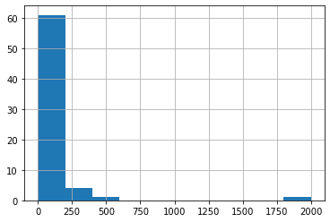
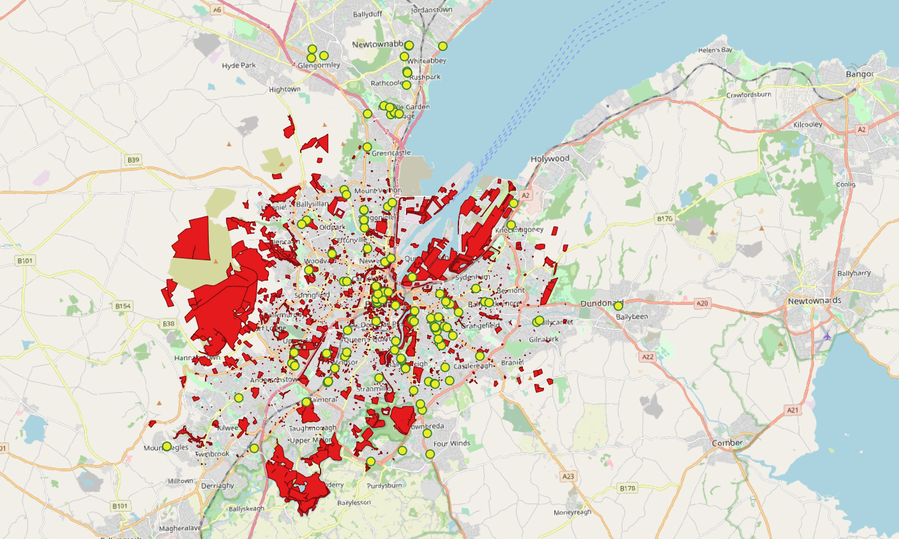
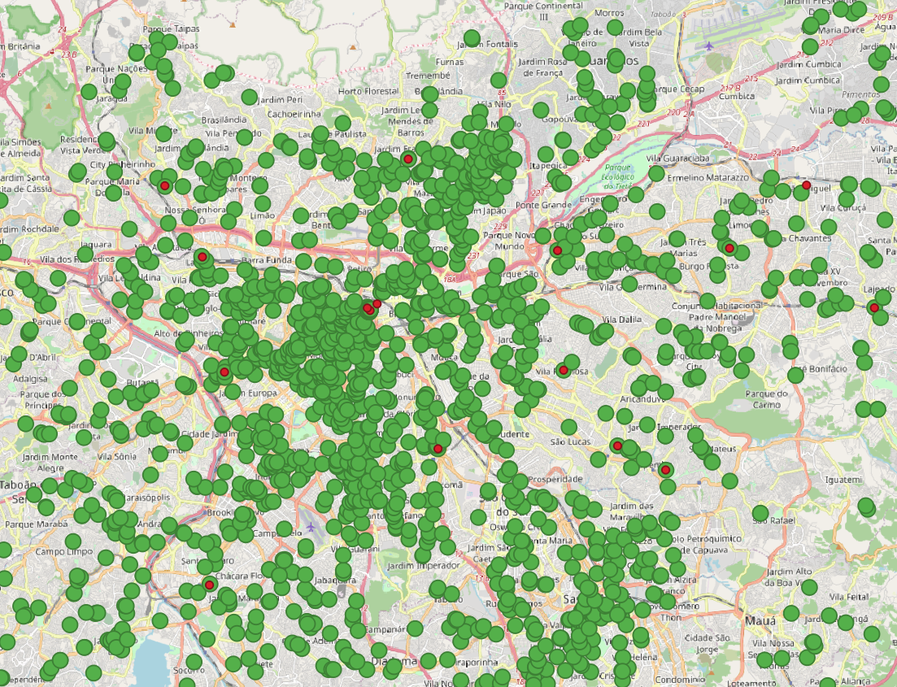
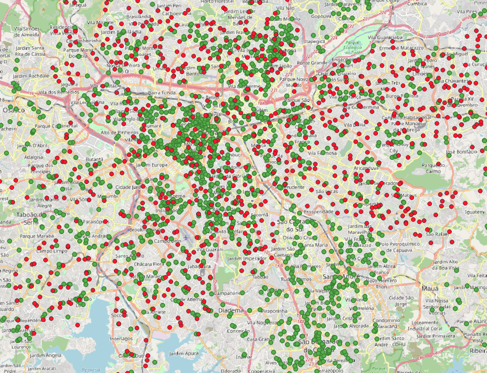
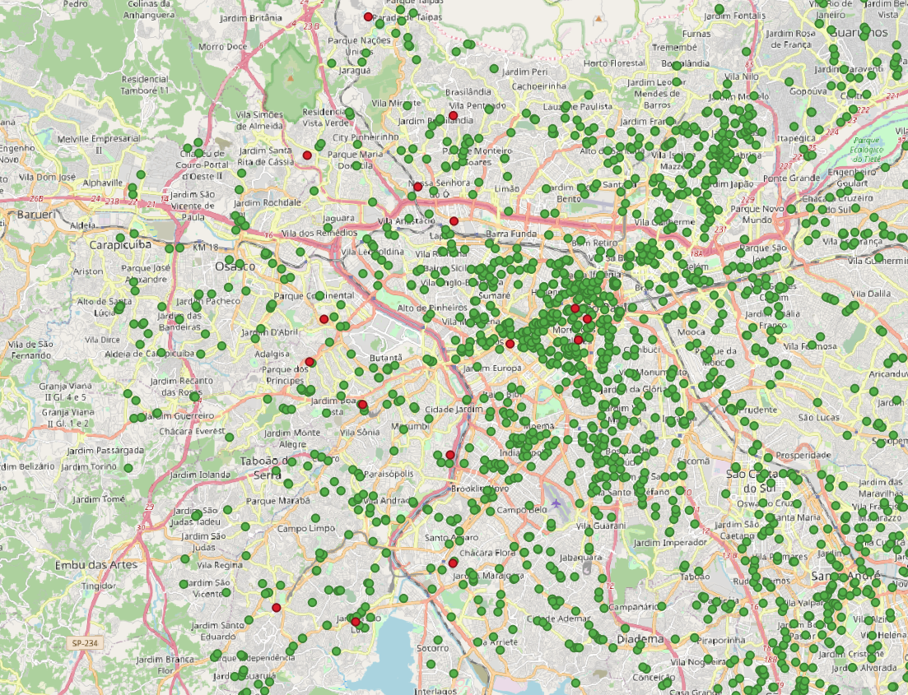
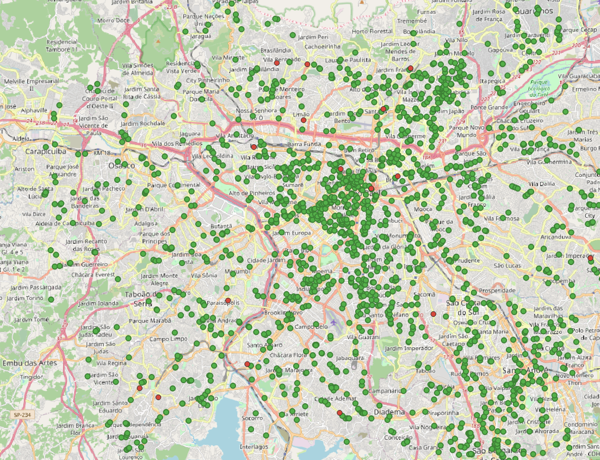
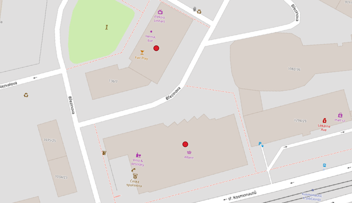

# Preliminary Findings:

Points of interest (freshfood and market) obtained from OSM for three cities of Olomouc, Belfast, and Sao Paulo are validated against the ones given by official collaborators from each city. 
Table 1 shows the summary of the datasets including datatype, size of the datasets, definitions of what were presented, as well as the intersection between OSM and official datasets of each city. 

We can see the three cities are very different in terms of the number of official fresh food points as well as how those points are captured by OSm. Olomouc has less fresh food related points than the other two cities, which is reasonable due to its smaller size. Moreover, the difference between the number of points in OSM and Official datasets in Olomous is much less than that in the other cities. OSM dataset has 4 more points than the official one. The OSM dataset in Sao Paulo is more than twice the size of the official one. On the other hand, OSM in Belfast covers only less than 10% of the points in the official datasets. This is due to the different definition of fresh food related. This information is in the last row of Table 1. Official fresh food related points in Belfast also include restaurants, which are not available in the OSM points leading to the much higher number of official points. Official data in Olomouc, while only includes supermarkets, is roughly the number of points in the OSM list, suggesting supermarkets are the main destinations for fresh food in this city. The interesting thing is in the case of Sao Paulo, while the official set includes many different forms of market including street market, which can be periodic features, not available in the OSM, the official dataset is still much smaller than the OSM one. These observations need further investigation by looking closely at the mismatched points. 

Instead of point features, official dataset in Belfast shows the polygon representation of the fresh food related features. According to the collaborator, these polygons are the parcels within which the pointers of fresh food related destination exist. 

**Table 1: OSM and Official Fresh food related points of interest in three cities**

|  | Belfast OSM| Belfast Official | Olomouc OSM | Olomouc Official | Sao Paulo OSM | Sao Paulo Official |
| --- | --- | --- | --- | --- | --- | --- |
| Number of points | 124 | 1479| 67 | 63 | 2132| 939 |
| Number of intersected points | 26 | 26 | 0 | 0 | 0 | 0 |
| Type of data | points  |polygons | points | points | points | points |
| Features included | Market, grocery, convenience store |Freshfood and Restaurant related|Market, grocery, convenience store | Supermarkets|Market, grocery, convenience store | street markets, municipal markets, municipal restaurants, grocery bigbags |

**Intersections and buffering:**

From Table 1 we can see that the number of official points intersected with the OSM dataset is very low in all three cities (26 in Belfast, and 0 in the other 2 cities). However, this might be due to the fact that these are mainly point representation of polygon features (shops/ market etc.) In the case of Sao Paulo street market, it can also be point representation of linear feature. 

In order to deal with this issue, we take buffer of the points before counting the intersections. For each city, we first take different buffers of the OSM datapoints. Number of official points falling within the buffer is reported. This number shows how many (and what percentage of the official pois are relatively close to an osm point - or falling within the buffer zone. This suggests whether the OSM dataset is a good representation of the official dataset or the situation in reality. Table 2 show the percentage of official dataset fall within the OSM point buffered by certain distance. 

As expected, the percentage of official POIs intersected with OSM dataset increases as the buffer of OSM points increases. For Olomouc, only with a buffer of 5m, over 90% of the official POIs fall within the OSM buffer. For Belfast and Sao Paulo, with the buffer of 30-35m, over half of the official POIs are intersected with the OSM dataset. With buffer of about 70, over 90% of the offical POIs in Belfast and Sao Paulo are intersected with their OSM dataset. This suggested that most of the official POIs are within a close distance to an OSM point (35m or less). 

Figures 1.a.b.c shows the distributions of the distances from the official POIs in each city to the closest OSM POI. The median distance from an official pois in Olomouc is 0.0m and in Belfast is 36.94m. The mean and median distances from official pois to the closest OSM pois in Sao Paulo are higher. This suggest the higher mismatched level between the 2 datasets in Sao Paulo than the other 2 cities.  

**Table 2: Percentage of Official POIs within buffered OSM POIs**

|  | Belfast| Olomouc| Sao Paulo |
| --- | --- | --- | --- |
| 5m buffer |28.06| 96.83| 23.32|
| 10m buffer |30.83 |96.83  | 25.35|
| 15m buffer |34.69|96.83 | 30.88 | 
|20m buffer |39.76|96.83| 35.36| 
|25m buffer |45.98|96.83| 41.21| 
|30m buffer |52.81|96.83| 47.92| 
|35m buffer |60.00|98.41| 54.42| 
|40m buffer |65.38|98.41| 61.02| 
|45m buffer |70.00|98.41| 67.63| 
|50m buffer |75.05|98.41| 73.38| 
|55m buffer |80.26|98.41| 79.13| 
|60m buffer |84.25|98.41| 84.35| 
|65m buffer |88.44|98.41| 88.71| 
|70m buffer |91.68|98.41| 93.50| 
|75m buffer |94.66|98.41| 95.31| 
|80m buffer |96.82|98.41| 96.59| 
|85m buffer |98.17|98.41| 97.44| 
|90m buffer |98.71|98.41| 97.76| 
|95m buffer |99.19|98.41| 98.30| 

**Figure 1.a: Belfast nearest distances (Mean: 373.26;
 Median: 36.94)**

**Figure 1.b:Olomouc nearest distances (Mean: 69.85; Median: 0.0)**

**Figure 1.c: Sao Paulo nearest distances (Mean: 1416.30; Median: 248.37)**

The three following sections summarize the findings from investigation of OSM and Official fresh food POIs with reference to Bing Map and google street map. What we are interested is that where OSM misses a point that is available in the Official dataset, what might be the reason. 

### 1. Belfast:
Figure 2 shows all the freshfood related pois in Olomouc from OSM (in yellow) and from official dataset (in red). The official layer is overlayed with the OSM layer. 

**Figure 2: Freshfood related pois in Olomouc**

We can see that there is a large number of freshfood related parcels in the official dataset not overlapped with any OSM pois. Most of the OSM pois are located within the city center or along the main highways. Most of other areas between those main routes do not have freshfood related location according to the OSM dataset. 

**Figure 3:**

There are three areas (figured) which do not have any OSM points. However, there are freshfood related official parcel in those areas. Referring to google street map as well as Bing Map, we can see that these areas are either mountain area, natural park, or airport. From the collaborator's information, the huge parcels which are not supposed to be freshfood related are available in the official dataset might be due to the fact that the information about where freshfood can be access is not as updated as the parcel map. There might be a small store in an area which is no longer there. As there result, the whole area is picked up as a freshfood related parcel instead of a small parcel. However, it still does not totally explain why the whole aiport, park, and mountain areas are recorded as several parcels where freshfood can be accessed. 

In this case, we can see that the OSM dataset is much more updated and clear in what type of information is included. However, the freshfood pois seem to be mainly market or supermarket, which tend to leave out large areas which are not along major artery as can be seen in figurec. This leads to the question of whether there are other destination types where people often access their freshfood. 

### 2. Sao Paulo
For Sao Paulo, since there are four different types of freshfood related pois included in the official dataset, we look into each type to evaluate how complete the OSM is against the official source. 

First of all, all the municipal market points in the official dataset can also be seen from the OSM one. Figure 4 shows that all the official municipal market (in red) are overlapped with a point in the OSM pois (in green). 

**Figure 4: Municipal markets in Sao Paulo**

On the other hand, most of the street markets from the official dataset are not available in the OSM dataset. In figure 5 we can see how all the street markets (in red) are not overlapped with points from the OSM dataset (in green). This can be due to the fact that street markets can be much larger or even linear features leading to inaccuracy when represent those in points. Another reason could be that street markets are periodic or not permanent features. As the result, OSM might not be able to capture those. This might raise the question when using OSM dataset to evaluate accessibility in terms of fresh food when street market seems to be an important and prevalent destinations of freshfood. 

**Figure 5: Street markets in Sao Paulo**

The grocery bigbags are also not overlapped with any OSM points despite being in quite close distance (figure 6). This is another case in which definition of freshfood pois in OSM dataset might not fully cover the real situation on the ground with different types of destination unique to certain locality. 

**Figure 6: grocery bigbags in Sao Paulo**

Since the OSM does not include restaurants in the definition of freshfood pois, none of the restaurant pois from the official data source is overlapped with the OSM data. 

**Figure 7: Municipal restaurants in Sao Paulo**

The mismatch between OSM and official datasets in Sao Paulo helps highlight an issue with using OSM data in studying accessibility which is the definition of freshfood destinations might be very different. The specific local situations would make cities vary so much that it is hard to have an universal method and process for all. 

### 3. Olomouc

Figure 8 shows all the freshfood related pois in Olomouc from OSM (in green) and from official dataset (in red). Since the official layer is overlayed with the OSM layer, the red dots, which are visible are the ones not overlapped with any pois from the OSM dataset or where the OSM is missing. We looked into the visible red dots to figure out what they are and why OSM is missing them. 

**Figure 8: Freshfood related pois in Olomouc**

Most of the pois from the official dataset, which are not available in the OSM one are not directly related to freshfood access as defined in our study. There are barber store, department store, studio, safe and vault shop, furniture store, and some restaurants among other things. Figure 9 shows two examples of the pois that are missing in the OSM. ALbert is a department store while another red dot lies between Herna bar and Fair Play restaurant. These mismatched between the official and the OSM datasets can be due to either the different definition of what had been included in each dataset for freshfood or the possibility that the official dataset is not as updated and the stores have been changed. In both cases, 
     
**Figure 9: Gaps in OSM freshfood related pois**

Although the mismatch between the two datasets is less in Olomouc than in Sao Paulo, OSM dataset has the same problem of different definitions for freshfood pois. 
